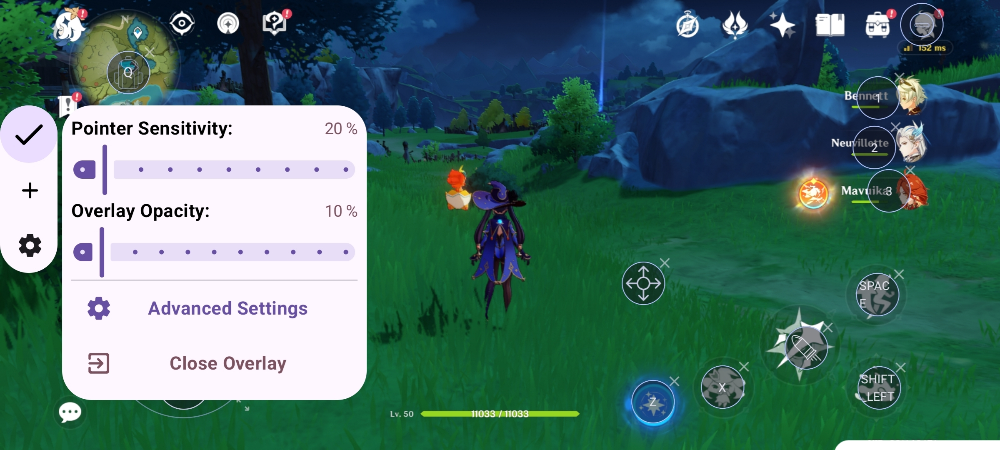
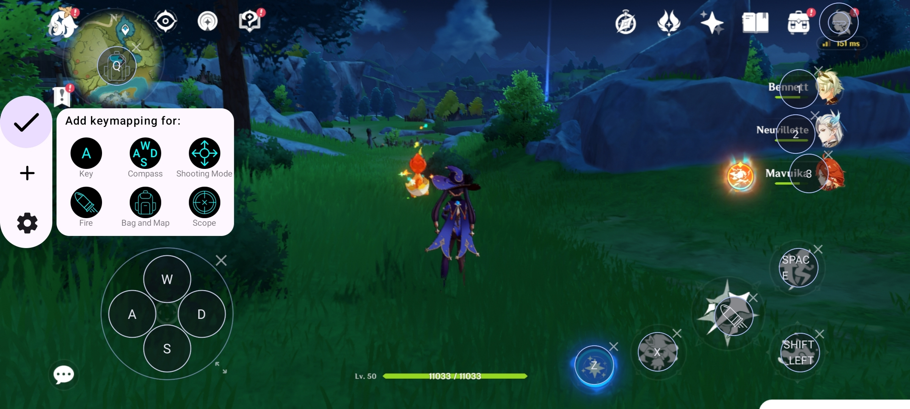

# KeySync

KeySync is an Android app that allows users to play games using an external keyboard and mouse
without requiring root access. It leverages [Shizuku](https://github.com/RikkaApps/Shizuku) to grant
necessary permissions and maps key events from external input devices to on-screen touch points.

> [!TIP]
> ## Experimental Native Input
>
> Work is in progress on an experimental branch **[feature/native](https://github.com/aka-munan/keysync/tree/feature/native)** introducing native input handling to reduce reliance on floating windows and UI-based listeners. Snapshot builds are available for testing, and changes will be merged into `main` once stable.

---

## Features

- 🎮 **Keyboard & Mouse Support** - Play mobile games with a keyboard and mouse.
- 🔄 **No Root Required** - Uses Shizuku for permission handling instead of rooting.
- 🎯 **Custom Key Mapping** - Map keyboard/mouse events to specific touch points on the screen.
- 🎭 **Anti-Detection Mechanism** - Introduces randomness in mapped touches to prevent detection by
  anti-cheat systems.
- 🔧 **Configurable Settings** - Customize mappings for different games and control layouts.

## Installation

1. Download and install the latest APK
   from [Release](https://github.com/aka-munan/keysync/releases).
2. Install and set up [Shizuku](https://shizuku.rikka.app/download/).
3. Open KeySync and follow the setup instructions.

## How It Works

1. **Install & Setup** - Install KeySync and grant permission to Shizuku.
2. **Connect Input Devices** - Attach an external keyboard and mouse(external devices will be
   recognised and displayed at the top of the screen).
3. **Add games** - Add your favorite games to the launcher using the fab button at the bottm.
3. **Create Key Bindings** -Launch the game from in-app launcher and Map keys to specific screen
   areas for in-game actions.
4. **Start Playing** - Use the keyboard and mouse seamlessly in mobile games.

## Usage

1. Open KeySync and ensure Shizuku is running.
2. Select or create a key mapping profile.
3. Launch your game and enjoy enhanced controls.

- ### Toggle Shooting Mode
  In Fps or Other Aim based games you might want to use "Shooting Mode" Draggable item **to Switch
  between Mouse pointer and in game aim** by default you can use **MMB (Middle mouse button)** to
  toggle Shooting mode.

## Permissions

- **Shizuku Access** - Required to simulate touch events.
- **Overlay Permission** - Needed to display touch indicators.

## Screenshots





---

## 🛠️ Build It Yourself

If you want to build **KeySync** from source:

### Prerequisites

* **Android Studio (latest stable)**
* **JDK 17**
* An **Android device (Android 11+)**

### Steps

```bash
git clone https://github.com/aka-munan/keysync.git
cd keysync
```
> [!NOTE]
> ### Signing Configuration
> To build a **release APK** and prevent gradle sync issues, add the following variables to
> `~/.gradle/gradle.properties`:
>
> ```properties
> storeFile=/absolute/path/to/your/keystore.jks
> storePassword=your_store_password
> keyAlias=your_key_alias
> keyPassword=your_key_password
> ```
>
> Or just comment out signing config related lines in `app:build.gradle.kts`


1. Open the project in **Android Studio**
2. Let Gradle sync completely
3. Connect your Android device (or emulator with Shizuku support)
4. Run the app using **Run ▶ app**


### Shizuku Setup (Required)

* Install **Shizuku** from Play Store or GitHub
* Start Shizuku via **ADB / Wireless Debugging**
* Grant Shizuku permission when KeySync asks for it

> ⚠️ Without Shizuku running, KeySync will not function.

### Notes

* No root access is required
* Works best with **physical keyboard & mouse**
* Emulator support may be limited due to input constraints

---

## 🤝 Contributing

Contributions are **very welcome** and appreciated ❤️
Whether it’s code, ideas, or bug reports — everything helps.

### How You Can Contribute

* 🐛 Report bugs or crashes
* ✨ Suggest new features or improvements
* 🎮 Improve key-mapping logic
* 🧪 Test on different devices / games
* 📖 Improve documentation

### Development Guidelines

* Follow existing **code style**
* Keep commits **small and descriptive**
* Test changes with **real input devices**
* Avoid introducing detection-sensitive behavior

### Submitting Changes

1. Fork the repository
2. Create a new branch

   ```bash
   git checkout -b feature/your-feature-name
   ```
3. Commit your changes
4. Push to your fork
5. Open a **Pull Request**

Please clearly explain **what** and **why** in your PR.

---

## Disclaimer

Using artificial touch events in games may violate their terms of service. Use this app responsibly
and at your own risk.

## Contributing

Contributions are welcome! Feel free to submit pull requests or report issues.
